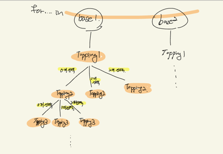

<h2><a href="https://leetcode.com/problems/closest-dessert-cost">1774. Closest Dessert Cost</a></h2><h3>Medium</h3>

You would like to make dessert and are preparing to buy the ingredients. You have <code>n</code> ice cream base flavors and <code>m</code> types of toppings to choose from. You must follow these rules when making your dessert:

<ul>
	<li>There must be <strong>exactly one</strong> ice cream base.</li>
	<li>You can add <strong>one or more</strong> types of topping or have no toppings at all.</li>
	<li>There are <strong>at most two</strong> of <strong>each type</strong> of topping.</li>
</ul>

You are given three inputs:

<ul>
	<li><code>baseCosts</code>, an integer array of length <code>n</code>, where each <code>baseCosts[i]</code> represents the price of the <code>ith</code> ice cream base flavor.</li>
	<li><code>toppingCosts</code>, an integer array of length <code>m</code>, where each <code>toppingCosts[i]</code> is the price of <strong>one</strong> of the <code>ith</code> topping.</li>
	<li><code>target</code>, an integer representing your target price for dessert.</li>
</ul>

You want to make a dessert with a total cost as close to <code>target</code> as possible.

Return <em>the closest possible cost of the dessert to </em><code>target</code>. If there are multiple, return <em>the <strong>lower</strong> one.</em>

&nbsp;

<strong class="example">Example 1:</strong>

<pre>
<strong>Input:</strong> baseCosts = [1,7], toppingCosts = [3,4], target = 10
<strong>Output:</strong> 10
<strong>Explanation:</strong> Consider the following combination (all 0-indexed):
- Choose base 1: cost 7
- Take 1 of topping 0: cost 1 x 3 = 3
- Take 0 of topping 1: cost 0 x 4 = 0
Total: 7 + 3 + 0 = 10.
</pre>

<strong class="example">Example 2:</strong>

<pre>
<strong>Input:</strong> baseCosts = [2,3], toppingCosts = [4,5,100], target = 18
<strong>Output:</strong> 17
<strong>Explanation:</strong> Consider the following combination (all 0-indexed):
- Choose base 1: cost 3
- Take 1 of topping 0: cost 1 x 4 = 4
- Take 2 of topping 1: cost 2 x 5 = 10
- Take 0 of topping 2: cost 0 x 100 = 0
Total: 3 + 4 + 10 + 0 = 17. You cannot make a dessert with a total cost of 18.
</pre>

<strong class="example">Example 3:</strong>

<pre>
<strong>Input:</strong> baseCosts = [3,10], toppingCosts = [2,5], target = 9
<strong>Output:</strong> 8
<strong>Explanation:</strong> It is possible to make desserts with cost 8 and 10. Return 8 as it is the lower cost.
</pre>

&nbsp;

<strong>Constraints:</strong>

<ul>
	<li><code>n == baseCosts.length</code></li>
	<li><code>m == toppingCosts.length</code></li>
	<li><code>1 &lt;= n, m &lt;= 10</code></li>
	<li><code>1 &lt;= baseCosts[i], toppingCosts[i] &lt;= 104</code></li>
	<li><code>1 &lt;= target &lt;= 104</code></li>
</ul>

---

## 문제 접근 

- 이 문제는 조합을 이용해서 풀 수 있는 문제. 
- 중요한건 문제 정의를 잘하는 것 
- 문제 정의 : 
  - 아이스크림 base는 1개만 선택해야 한다
  - 토핑의 타입은 0 개부터 ~ 주어진 토핑 타입만큼 모두 선택할 수 있다.
  - 하나의 토핑 타입에는 최대 2개 까지 선택할 수 있다.

- 상태 공간 트리
  

**하나의 토핑이 주어졌을 때, 3가지의 선택권이 있다. 문제에서 어떤 토핑을 선택할지는 중요하지 않고 선택할 수 있는 토핑의 개수가 중요하다.**
그래서 토핑을 선택할 때, 0개, 1개, 2개를 선택할 수 있는 경우의 수를 구해야 한다.
각 토핑을 0 개 선택할 때, 1개 선택할 때, 2개 선택할 때의 값을 비교한다.
선택할 수 있는 범위내에서 target이 나오면 그 값을 반환한다.
주어진 토핑을 모두 선택후 target이 나오지 않으면 그 중 가장 가까운 값을 반환한다.

- 1번 토핑을 선택할 때
  -  0 개 선택
  -  1 개 선택
  -  2 개 선택
- 2번 토핑을 선택할 때
  -  0 개 선택
  -  1 개 선택
  -  2 개 선택
